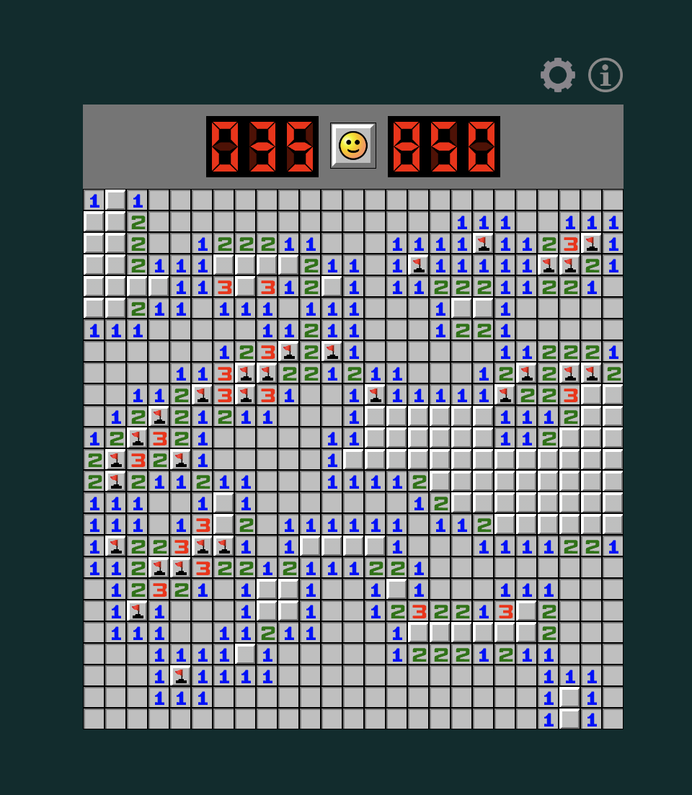
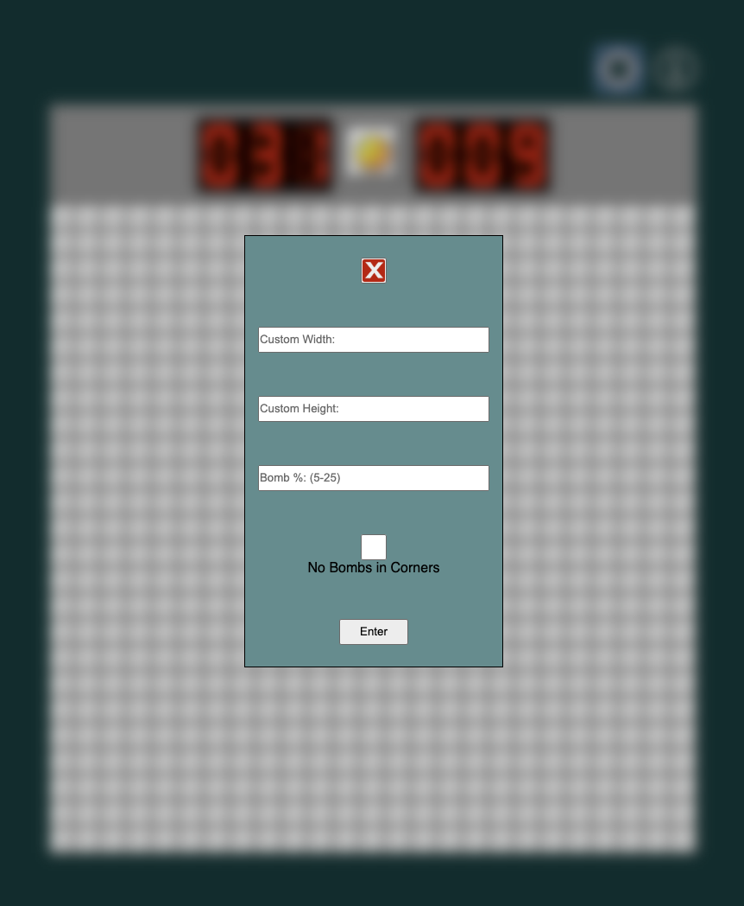
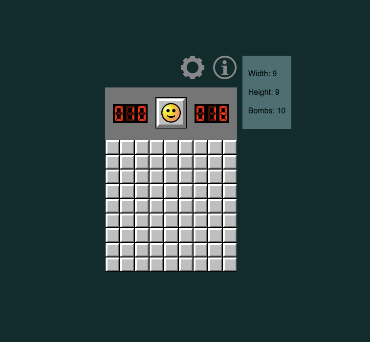

# minesweeper

## About

Hi, I'm Aaron and I've been a long time enjoyer of minesweeper. My love for the game started in my school days, where minesweeper was a reliable time waster that could be played on every school computer. I originally learned how to play on the family computer long before I knew how to program. Later, my skills were honed on what is, in my opinion, the best website to play minesweeper on: 
https://minesweeper.online/

## What is minesweeper, and how do you play?

### History
Contrary to popular belief, Microsoft did not invent minesweeper. It was based off of a game called
Relentless Logic (R-Logic), created by Conway, Hong and Smith in 1985. Curt Johnson created 
Microsoft Minesweeper in 1990, and it has been a logic puzzle staple ever since. 

The theme of R-Logic and Minesweeper are similar. There is a grid with mines with unknown locations,
and the player must navigate the playing field without triggering the mines. 

### How to play
The objective of minesweeper is to clear the board of all tiles except for any mines. If the player steps on a mine, then they lose.

As the player uncovers tiles, the uncovered tile will either have no number, or have a number, indicating how many mines are in the adjacent tiles. Through logic, the player can safely deduce which tiles cannot be mines, and uncover more tiles, thus revealing more information that can be used to further progress.

That being said, minesweeper is traditionally not a game of pure logic, as there are situations where mines can be in various configurations and still satisfy the numbers indicated, the player must take chances. Without manipulated mine generation, there are games that may or may not require guessing. 

A more in depth explanations on the exact strategies used to effectively navigate a game, visit:
https://minesweeper.online/help/patterns

## Key terms:
### Flagging
The player can indicate which tiles are known mines by placing a flag. In this game, this is done with right click on a mouse (currently not supported on mobile). 

### Chording
If a player has placed flags down, and the amount of flags adjacent to a number satisfies its value, the player can "chord" which means to automatically uncover all the adjacent tiles that are not flags. In this game, this is done by left clicking the number that has been satisfied.

## Getting Started:
The game can be found at:
https://anranlee99.github.io/minesweeper/

The source code can be found at:
https://github.com/anranlee99/minesweeper

## Screenshots:
<figure>
  <figcaption>Gameplay</figcaption>
  
</figure>

<figure>
  <figcaption>Custom Settings Menu</figcaption>
  
</figure>

<figure>
  <figcaption>Hover Menu</figcaption>
  
</figure>

## Technologies Used:
### NOTE: as of 9/23/2022, game settings can be unintentionally accessed by the user in the browser's development tools, doing so may result in an unsatisfactory playing experience. 
- HTML
- CSS
- JavaScript

## Developer message + Next Steps:
Minesweeper is a timeless classic that does not require being reinvented. The focus of the this recreation heavily emphasizes a way of programming minesweeper without nested arrays. With the use  of IDs and CSS formatting, this game has been implemented without any data structure representing an abstraction of the mine locations. 

All functions interacting with the mine locations act on the IDs. The logic performed when calculating adjacent tiles act as if it the board were in an array, but the functions that perform the subsequent actions only act on the DOM element targeted by its ID. 

A feature in the settings menu allows the player to never uncover the mines in the corner, as it is optimal strategy to begin in the corners, and I find it frustrating to lose when doing so. 

A future endeavor for the project is to implement 2 key features which are not feasible at the moment given the design architecture:
1) To never uncover a mine on the very first move
2) To have an option with "No Guess Mode", in which, the player will never encounter a situation where the player has to guess. 

In addition to the above, one final goal of the project is to create a site where I genuinely enjoyed playing, rather than to just be satisfied with a working, but boring game. 